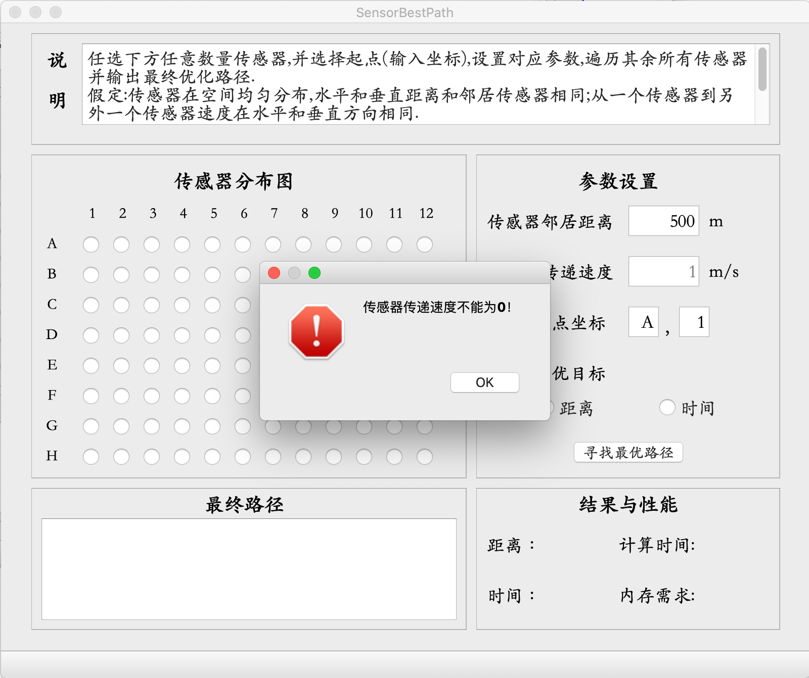

# 物联网应用基础IOT期中项目

该项目为同济大学软件学院2020年物联网应用基础的期中项目。

**[注意事项]**

由于在macOS开发移植到windows，所以界面可能会有些许问题，还请以文档中图形为主，功能均正常使用！


## 1 项目要求

如下面传感器分布图，1-12列，A-H行；任选其中任何数量传感器，选择一个起点，遍历其余所有选择的传感器，寻找最优路径，最优目标两种：时间和距离。


假定:传感器在空间均匀分布，水平和垂直距离和邻居传感器相同:从一个传感器到另外一个传感器速度在水平和垂直方向相同；如：邻居距离为500米，速度为1米/秒。具体参数程序需要设置可调。

**具体要求：**

1. 传感器12 × 8，可选任意多的点；
2. 可以设置参数：
   - 相邻传感器间的距离；
   - 传感器传输速度；传感器起点；
   - 选择最优目标：距离、时间；
3. 显示：
   - 最终优化路径；
   - 遍历后距离、时间；
   - 程序（算法）的运行时间、内存需求。


## 2 实现概述

### 2.1 开发环境

- **操作系统**：macOS Catalina 10.15.6
- **开发工具**：Qt Creator
- **开发环境**：Based on Qt 5.14.1 (Clang 10.0(Apple),64bit)
- **开发语言**：C++

### 2.2 程序界面

以下为**macOS**下的界面，因移植原因，**windows系统**中实际界面可能略有不同。


### 2.3 使用说明

在传感器分布图中选择要遍历的传感器节点，在参数设置中设置相应参数，确保数据正确后（不正确会有对应的提示）点击**寻找最优路径**按钮，开始寻找最优路径。寻找结束，在最终路径窗口按顺序显示路径上各点的坐标，结果与性能窗口显示此次最优路径的距离、时间以及程序的计算时间和内存需求。


## 3 程序设计

### 3.1 类设计

SensorBestPath采用经典的**MVC架构**，其中在Qt集成环境下，View可以直接使用Qt Designer来实现，Model类中记录传感器的节点以及全部参数，而Controller实现对View的控制，以及对Model中数据的处理。

**Model:Sensor类**

|          **成员类型**           |       **成员名称**       |              **说明**              |
| :-----------------------------: | :----------------------: | :--------------------------------: |
|          public struct          |           Node           |          传感器节点结构体          |
|             public              |         Sensor()         |              构造函数              |
|      public QVector<Node>       |        sensorNode        |           存放传感器节点           |
| public QVector<QVector<double>> |         nodeDis          |            距离邻接矩阵            |
|  public QVector<QVector<int>>   |         nodeTime         |            时间邻接矩阵            |
|      Qpublic Vector<bool>       |        isVisitied        |            节点是否遍历            |
|       public QVector<int>       |           path           |            存储最终路径            |
|           public int            |       sensorCount        |             传感器数量             |
|           public int            |         distance         |              邻居距离              |
|           public int            |          speed           |             传感器速度             |
|    public QMap<QString,int>     |       letterToNum        |           A-H与数字对应            |
|    public QMap<int,QString>     |       numToLetter        |           数字与A-H对应            |
|           public int            |          startX          |             起点横坐标             |
|           public int            |          startY          |             起点纵坐标             |
|           public int            |         startNo          |              起点序号              |
|           public int            |          target          | 最优目标：最短距离为0，最短时间为1 |
|          public double          |      finalDistance       |           最优路径的距离           |
|           public int            |        finalTime         |           最优路径的时间           |
|          private void           |        initLTN()         |       初始化map letterToNum        |
|          private void           |        initNTL()         |       初始化map numToLetter        |
|          public double          | getUsedMemory(DWORD pid) |            获取占用内存            |

**Controller:ViewController类**

|    **成员类型**    |                   **成员名称**                   |                    **说明**                    |
| :----------------: | :----------------------------------------------: | :--------------------------------------------: |
|       public       |    ViewController(QWidget *parent = nullptr)     |                    构造函数                    |
|   public Sensor    |                      sensor                      |                   model创建                    |
| private slots void |              on_findPath_clicked()               |               点击寻找按钮槽函数               |
| private Ui::View * |                        Ui                        |                获取View中的控件                |
|    private int     |      numTransByCoordinateX(int coordinateX)      |               根据横坐标确定行号               |
|    private int     |      numTransByCoordinateY(int coordinateY)      |               根据纵坐标确定列号               |
|    private void    |                    initMap()                     |               初始化传感器分布图               |
|    private void    |                   printInfo()                    |             输出所有参数 便与调试              |
|    private void    |                  printVex(bool)                  |                  输出邻接矩阵                  |
|    private void    |                  initNodeDis()                   |               初始化距离邻接矩阵               |
|    private void    |                  initNodeTime()                  |               初始化时间邻接矩阵               |
|    private Node    |                findSensor(int No)                | 根据传感器节点的编号在vector中查找并返回此节点 |
|    private int     |       getSensorsDis(Node nodeI,Node nodeJ)       |          计算两个传感器节点之间的距离          |
|   private double   |      getSensorsTime(Node nodeI,Node nodeJ)       |          计算两个传感器节点之间的时间          |
|    private int     | shortestPath(int start,QVector<QVector<double>>) |                贪心算法距离最短                |
|    private void    |  shortestTime(int start,QVector<QVector<int>>)   |                贪心算法时间最短                |
|    private void    |                    findPath()                    |                  寻找最短路径                  |
|    private void    |                    showPath()                    |                    输出路径                    |

**View:View.ui**

Qt自带的Qt designer通过控件布局生成。

### 3.2 算法设计与实现

#### 3.2.1 算法说明

项目要求在示意图中选定任意数量的传感器，共8行12列，96个节点，所以传感器数量在0-96个。选定一点为起点，遍历其余所有的点，可以多次经过某一点或某一条边。因为是传感器节点，所以每两个传感器之间都是直接相通的，最优目标两种：距离与时间，可以认为只是每两个传感器之间路径的“权值”不同，则从图论来看问题归纳为无向带权完全图遍历全部节点的最短路径问题。这个问题很类似于旅行商问题（又称中国邮差问题、TSP问题），在TSP中要求每个节点只允许经过一次，并且要最终返回起点。由于在本题中，任意两个传感器节点都有一条带权值的边连通，所以要求中的“可以多次经过某一点或某一边”是不影响题目的，在网格中从一个点到另一个点的距离小于等于经过中间节点再到目标点的距离，所以可以看做是不需要返回节点的TSP问题。

TSP问题是一个NP难或NPC难题，实质是在带权完全无向图中找一个哈密顿回路，可行解是所有顶点的全排列，随着顶点数的增加，会产生组合爆炸。数据规模较小时，可以使用精确算法求解，如穷举法、动态规划、贪心算法等，但数据规模较大时，现在一般使用启发式算法，如遗传算法、蚁群算法、模拟退火等与神经网络相关的算法。本题中节点个数最多为96个，当节点为12时，需要穷举4亿八千万种情况，计算机大约需要1小时的时间，显然不可能在较短时间内找到准确的解，只能找到近似的最优解。本程序中使用了贪心算法的思想，实现较为简单，只需要每一步时寻找距离当前节点最近的点，直至所有点全部被访问。

#### 3.2.2 关键函数

**1.void View::initNodeDis()** 

```C++
void View::initNodeDis() {
    Node nodeI,nodeJ;
    QVector<QVector<double>> temp(sensor.sensorCount,QVector<double>(sensor.sensorCount));
    for(int i = 0;i < sensor.sensorCount;i++) {
        nodeI = findSensor(i);
        for(int j = 0;j < sensor.sensorCount;j++) {
            nodeJ = findSensor(j);
            temp[i][j] = getSensorsDis(nodeI,nodeJ);
        }
    }
    sensor.nodeDis = temp;
}
```

初始化距离邻接矩阵，构造一个用距离作为权值的图。**void View::initNodeTime()**原理与此函数相同。

**2.Node View::findSensor(int No)**

```c++
Node View::findSensor(int No) {
    foreach(auto node,sensor.sensorNode) {
        if(node.No == No) {
           return node;
        }
    }
}
```

根据节点的序号返回该节点，以便获取他的行号列号从而求得到其他节点的距离和时间。

**3.double View::getSensorsDis(Node nodeI, Node nodeJ)**

```c++
double View::getSensorsDis(Node nodeI, Node nodeJ) {
    double xGap = abs(nodeI.X-nodeJ.X);
    double yGap = abs(nodeI.Y-nodeJ.Y);
    if(xGap == yGap) {
        return xGap * sqrt(2) * sensor.distance;
    } else {
        return xGap > yGap ? (yGap * sqrt(2) * sensor.distance + (xGap-yGap) * sensor.distance) : (xGap * sqrt(2) * sensor.distance + (yGap-xGap) * sensor.distance);
    }
}
```

根据传入的两个节点计算他们之间的距离。**int View::getSensorsTime(Node nodeI, Node nodeJ)**原理与此函数相同。

**4.void View::shortestPath(int start,QVector<QVector<double>> sensorDis)**

```c++
void View::shortestPath(int start,QVector<QVector<double>> sensorDis) {
    if(sensor.path.count() == sensor.sensorCount) {
        return;
    }
    sensor.isVisitied[start] = true;
    sensor.path.append(start);
    double minCost = 1e10;
    int minTime;
    int nextNode;
    for(int i = 0; i < sensor.sensorCount;i++) {
        if(sensorDis[start][i] < minCost && sensorDis[start][i] > 0 && !sensor.isVisitied[i]) {
            minCost = sensorDis[start][i];
            minTime = sensor.nodeTime[start][i];
            nextNode = i;
        }
    }
    if(minCost < 1e9) {
       sensor.finalDistance += minCost;
       sensor.finalTime += minTime;
    }
    shortestPath(nextNode,sensorDis);
}
```

寻找距离当前节点最近的节点，找到最近节点后将下一节点加入到路径数组，并更新当前路径的距离和时间，递归调用直至所有节点全部被访问。**void View::shortestTime(int start,QVector<QVector<int>> sensorDis)** 与此函数同理。

### 3.3 其他函数设计与实现

**1.通过UI界面按钮的坐标得到节点的行号列号**

```c++
int View::numTransByCoordinateX(int coordinateX) {
    return (coordinateX-50)/30 + 1;
}

int View::numTransByCoordinateY(int coordinateY) {
    return (coordinateY-80)/30 + 1;
}
```

由于节点数过多，从**Button**的ID或Name不方便获取该节点信息，但是Button是在网格中，横纵坐标十分有规律，所以考虑从按钮的坐标获取按钮的具体信息。

**2.初始化传感器示意图**

```c++
void View::initMap() {
    sensor.sensorCount = 0;
    sensor.sensorNode.clear();
    Node temp;
    QList<QRadioButton*> buttons = ui->sensorMap->findChildren<QRadioButton*>();
    foreach(auto btn, buttons){
        if(btn->isChecked()) {
            sensor.sensorCount++;
            temp.X = numTransByCoordinateY(btn->geometry().y());
            temp.Y = numTransByCoordinateX(btn->geometry().x());
            temp.No = sensor.sensorCount - 1;
            sensor.sensorNode.append(temp);
        }
    }
}
```

从UI中获取frame:**sensorMap**中全部被选中的button，获取他们的信息（坐标、序号）存入sensorNode.

**3.点击寻找最优路径的槽函数**

进行错误处理、从UI界面获取信息用于初始化sensor(Model)中的信息、调用其他函数展示输出结果、计算时间、内存消耗等，均在此函数中调用完成。


## 4 项目展示

### 4.1 按距离最短寻找最优路径


如上图，选择三点，设置参数进行按距离最优寻找，可以得到最优路径为(A,1)->(A,5)->(D,4)，这个路径所需距离为3707.11，而如果选择(A,1)->(D,4)->(A,5)，则需要3828.23米。（为了方便说明，选择较为简单的点和图。）

### 4.2 按时间最短寻找最优路径


同样，按时间为最优目标，则选择4.1中另一路径，只需要3000s，而另一路径需要3500s。

### 4.3 错误处理

#### 4.3.1 未选择任何传感器


#### 4.3.2 未设置距离或速度参数

两个参数的控件设置只能输入数字。




#### 4.3.3 选择起点不在传感器分布图中

起点横坐标只可以输入大写字母A-H，第二位只可以输入数字。


